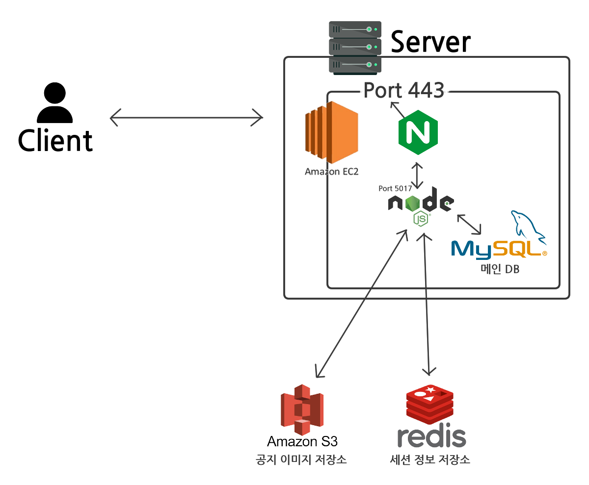
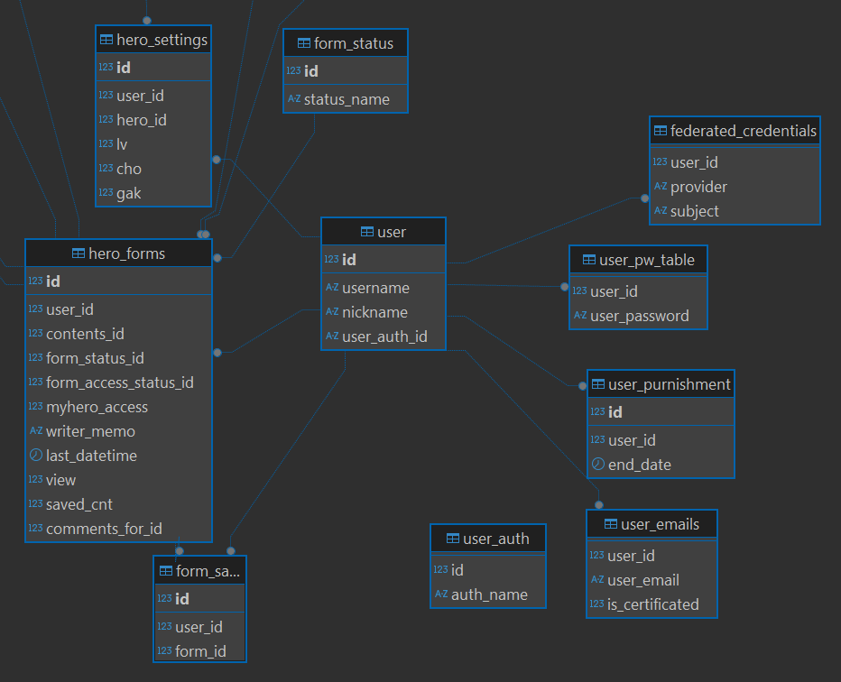
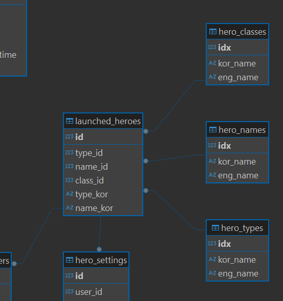
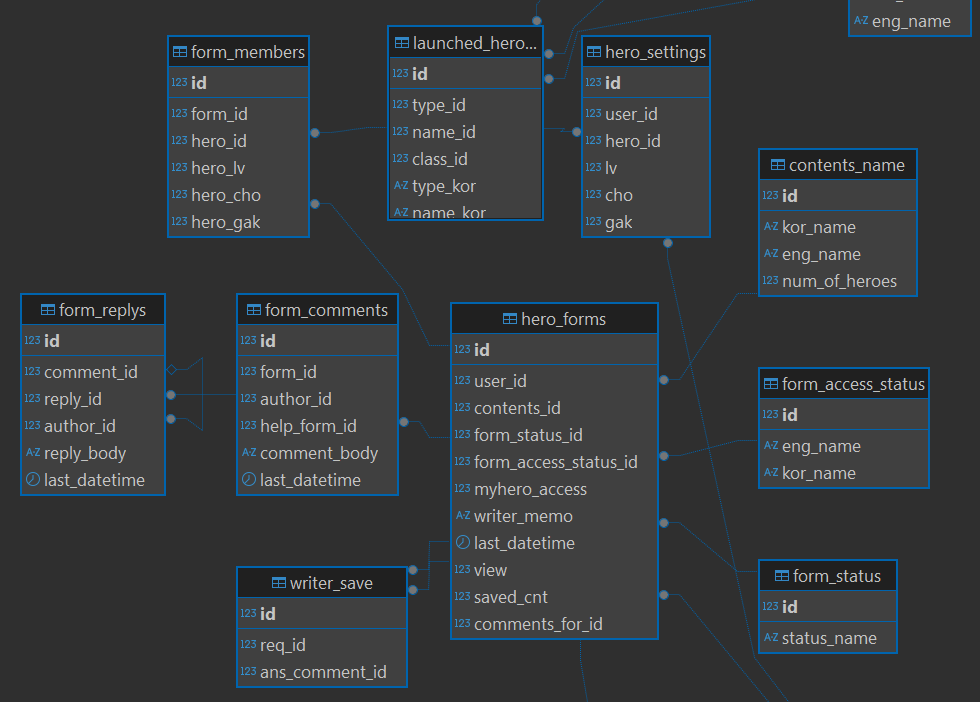
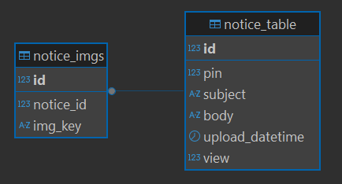
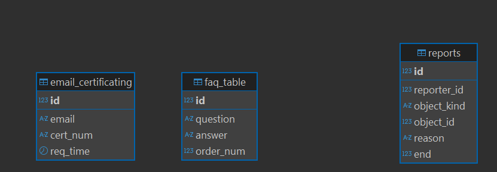

## 로드의 전술서

### 개요
 **접속 링크 (PC버전 최적화) : [https://lordtactics.com](https://lordtactics.com)**  

 웹사이트 \<로드의 전술서\>는 **모바일 게임 \<로드 오브 히어로즈\>에 대한 팬메이드 웹사이트**입니다. 해당 게임의 플레이를 보조하기 위하여 **캐릭터 조합을 짜서 공유할 수 있고, 타 유저에게 도움**을 줄 수도 있는 **커뮤니티 사이트**입니다.

### 팀내 역할
* 팀의 구성  
  * 디자이너 1인
  * 개발자 1인  
* 역할 분담  
  * 디자이너 : 필요한 페이지의 디자인을 포토샵으로 제작하여 이미지 파일로 전달  
  * **개발자** : 해당 페이지의 **퍼블리싱부터 백엔드 개발까지 개발의 전반적인 과정**을 수행  
  * 기획은 함께 진행하였음.

### 전체 시스템 구조

* 서버는 **AWS의 EC2 서버**를 빌려서 호스팅 형태로 구현.  
  * AWS 서버가 다소 비싸지만 많이 사용되기 때문에 **확장성이 높고 참고 자료가 많아 다양한 문제 대처에도 수월할 것**이라고 생각하여 해당 형태를 채택.  
      
* 서버 내부는 **Nginx가 앞단에서 nodejs 서버를 연결하는 리버스 프록시** 방식.  
  * nodejs는 로컬 포트로 웹사이트를 출력하고, Nginx가 이 결과를 https 포트로 중개함.  
  * 직접 포트포워딩을 하는 것보다 **보안에 좋고 관리가 편할 것**이라고 예상되어 채택.  
      
* 백엔드 구현은 **nodejs,** 프론트 구현은 nodejs의 템플릿엔진인 **ejs와 jQuery**로 구현.  
  * 너무 복잡하지 않은 프레임워크, 단순한 기술들로 우선 구현해보며 **모던 기술들의 필요성을 직접 체감**하고 싶었음.  
      
* 메인 DB를 담당하는 **MySQL은 EC2 서버 내부에서 로컬**로 사용함.  
  * AWS RDS보다 이 형태가 **가격이 조금 덜하며** 개발환경과 거의 동일하므로 **배포가 편리할 것으로 예상**되기 때문에 로컬 DB를 사용하기로 하였음.  
* 공지사항 글 작성시 이미지는 AWS S3에 저장됨.  
  * 가변적 데이터이므로 관리 및 구현 편의상 채택.

* 로그인을 위한 세션 데이터는 Redis Store 클라우드에 저장.  
  * 램 기반 스토리지로 빠르고, 무료이기 때문에 채택.

### DB 구조(ERD)
*툴프로그램인 DBeaver 다이어그램 활용*

#### **유저 관련**

* 왼쪽은 사이트 고유 기능 관련, 오른쪽은 유저의 권한 및 인증 관련  
* 사이트 고유 기능 관련 테이블들은 다양한 테이블들과 Foreign key로 연결되어 있음.  
* user\_auth 테이블에는 이용자 등급 id와 이름이 적혀 있음.  
  * 0 \- 관리자 / 1 \- 일반이용자  
  * 간단해서 연결해두지는 않았음.  
* 가운데에 있는 user 테이블의 유저 데이터 하나가 연결된 다른 테이블들의 데이터를 ‘보유’함.  
  * 유저 한 명이 비밀번호도 있고, 정지 내역도 있고, 편성 내역(hero\_forms), 캐릭터 설정 데이터(hero\_settings)도 있고….

#### **출시 캐릭터 관련**

* 출시된 캐릭터 하나는 클래스(직업), 이름, 타입(속성)으로 세 가지 정보를 가진다.  
  * 데이터 예시 ) 가디언, 헬가, 불 / 워리어, 헬가, 물  
* hero\_classes, hero\_names, hero\_types 세 가지 테이블에는 각각 클래스 종류, 이름들, 속성 종류가 데이터로 기록되어 있음.

#### **편성 관련**

* 중심이 되는 hero\_forms 테이블에 편성(캐릭터 조합) 데이터가 저장됨.  
  * 편성 데이터는 \[해당 편성의 공개 여부 / 작성자의 캐릭터 정보 공개 여부 / 한마디\] 등  
* 편성 하나는 게시글처럼 다뤄지므로, 이에 대한 댓글(form\_comments)과 답글(form\_replys)도 존재.  
* hero\_setting은 유저 데이터와 연결되어 있지만, 편성을 생성할 때 form\_members의 데이터는 hero\_setting의 데이터를 참조함.

#### **그 외**

* 공지사항에 첨부되는 이미지 내용을 관리하기 위해 이미지 테이블을 추가.  
* 공지사항이 생성되거나 편집될 때 notice\_imgs 테이블과 비교하여 AWS S3 스토리지의 이미지 데이터를 관리함.

 

* email\_certificating 테이블은 이메일 주소 확인을 위한 테이블.  
  * 이벤트 등록 \> 1시간마다 데이터 본 후 1시간 이상 된 데이터는 모두 삭제함  
* faq\_table 테이블은 자주 묻는 질문의 질문과 답변 내용 저장.  
  * order\_num은 순서 저장  
* reports 테이블은 신고 내용 저장.   
  * 신고가 처리되면 end 컬럼 데이터를 1로 전환.

### 주요 기능과 구조 소개

#### **기사단 편성**
캐릭터 조합을 만들어 저장하는 기능입니다. 본 기능이 웹사이트의 메인 기능이라고도 할 수 있습니다.

**캐릭터 편성 제작**  
* 캐릭터를 하나 선택할 때, 위와 같은 클래스에서 선택된 캐릭터 모음에 캐릭터를 추가한 뒤, 캐릭터 모음의 내용을 UI에 표시하는 방식으로 구현함.  
* 최종적으로 제출 시에는 선택된 **캐릭터 모음 배열을 백으로 전달**함.  
* 백에서는 이를 바탕으로 멤버 데이터를 저장  
* 편성의 내용이 변경될 때마다 **주소창의 쿼리를 변경함**  
  * 만든 편성을 굳이 업로드하지 않고 이 화면에서 **주소만 복사해도 똑같은 편성을 타인과 공유할 수 있음.**  
  * 다른 화면에서 **뒤로가기를 누르거나 새로고침 되어도** 제작했던 편성이 그대로 유지됨.

**캐릭터 필터**
* 필터링 절차  
1. 정렬 방식을 확인하여 전체 영웅을 정렬  
2. 이름, 보유영웅 체크여부, 속성, 클래스 내용을 확인  
3. 모두 삭제한 뒤 조건에 부합하는 캐릭터들만 새로 출력  
* 필터가 변경될 때마다 위의 절차를 모두 수행함  
* 이 방식을 선택한 이유  
1. 매번 백과 통신하는 것보다 빠를 것으로 예상되기 때문  
2. 정렬과 필터링을 동시에 하기 위해서는 모두 삭제하고 새로 출력하는 게 편함.

#### **게시판과 마이페이지 편성 조회**
 게시판에서는 유저들이 공개 설정으로 저장한 편성들을, 마이페이지에서는 해당 유저가 직접 만든 편성이나 ‘편성 저장’한 타인의 편성들을 보여줍니다.

**조회 페이지**  
* 필터 흐름은 다음과 같음.  
1. 필터 내용을 선택하여 **필터가 변경되면 즉시** 필터 form을 제출하며 새로고침.  
2. 백에서 필터 확인 후 **where 절 생성**  
   1. 편성 상태나 컨텐츠 등은 단순히 id로 거름  
   2. 캐릭터 필터는 **멤버 테이블에**서 지정된 캐릭터들의 데이터들을 뽑은 뒤, 한 편성에 뽑힌 데이터가 **필터 캐릭터의 인원과 일치하는 편성**만 출력.  
3. 생성한 where절을 삽입하여 sql문 완성, 실행하여 결과 얻어냄.  
4. 결과 테이블을 프론트(ejs 템플릿)로 보내면 검색 결과 화면을 생성하여 보여줌.

   

* **편성 정보와 편성의 멤버 정보가 따로 보관되기 때문에** 캐릭터 필터에서 이와 같은 방식으로 구현.

**자세히보기**  

* 이 화면은 게시판과 마이페이지에서 모두 동일함.  
* 편성 내용은 단순히 id로 조회하여 해당 내용을 출력.  
* 댓글 및 답글 구현  
  * 해당 편성에 대한 댓글과 답글을 조회하여 템플릿으로 만들고 출력  
  * 최초 출력 후, 댓글을 수정 혹은 삭제하거나 신규 댓글을 추가할 때마다 ajax를 통해 댓글 영역을 새로고침  
  * **댓글을 표현하는 알고리즘**  
1) 게시물에 대한 댓글과 답글, 댓글 중 도와주는 편성 멤버를 읽어 보내줌.  
2) comments 데이터의 결과물에서 댓글 하나를 먼저 표시함  
3) reply 데이터의 결과물에서 답글들을 표시함  
4) reply 데이터의 comment\_id가 일치하지 않으면 다음 댓글로 넘어감.  
   * **댓글을 삭제하는 알고리즘**  
1) 유저가 삭제 버튼을 누르면 해당 댓글(혹은 답글)의 아이디와 종류(comment/ reply)를 백으로 전송.  
2) 정보를 받으면 해당 댓글의 존재 여부와 권한 확인  
3) 해당 댓글을 참조하는 답글이 있으면 레코드의 유저 정보와 내용만 변경  
4) 해당 댓글을 참조하는 답글이 없으면 레코드 자체를 삭제.  
   * 레코드를 삭제하면 DB에서 삭제 설정이 Cascade로 되어있으므로 참조하는 답글들도 모두 삭제됨
